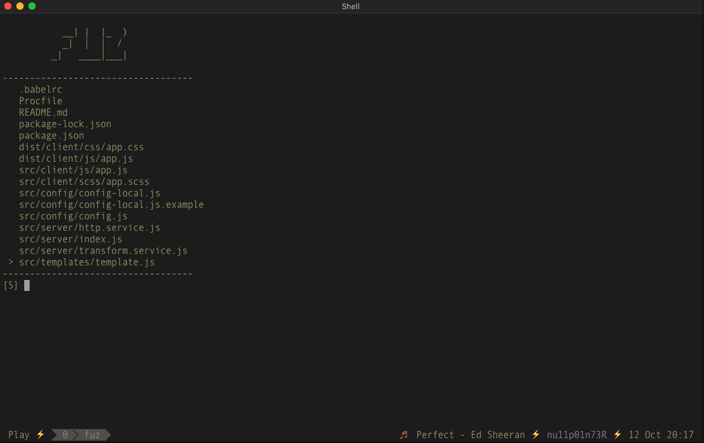

# Fuz


```


                                          __| |  |_  )
                                          _|  │  │  / 
                                        _|   ____│___|


```

Fuzzy search the current directory for files. `fuz` is a simple utility
written in golang, which lists the files in the current directory.
You can search through the filenames and open the file that you are 
looking for with ease.


<hr>



# Installation

Easiest way to install is using `go get` command,

```
$ go get github.com/nu11p01n73R/fuz
```

You can also clone the repo and do `go install`,

```
$ git clone https://github.com/nu11p01n73R/fuz.git
$ cd fuz
$ go install
```

# Usage

Fuz has 2 modes,

 - Normal Mode 
 - Search Mode

Use `Esc` to toggle the mode. `fuz` starts up in search mode. In
search mode, you can type in you search string, the file list
will get filtered accordingly.

In normal mode, `j` and `k` keys can be used to move up and down
the file list. On pressing `Enter`, the file will be opened up
in your `$EDITOR`. Use `q` to quit.

To summarize,

```
j       Move downwards
k       Move upwards
Enter   Open file
q       Quit
Esc     Toggle mode
```
 
The current mode, will be displayed next to the search space,

```
[S]     Search Mode
[N]     Normal Mode
```

# Improvement

- The search algorithm need to be improved to add scoring for the filterd files.
The scoring needs to be calculated from how near the search string are in 
the main string. The files have to be then displayed on order of the
scores.
